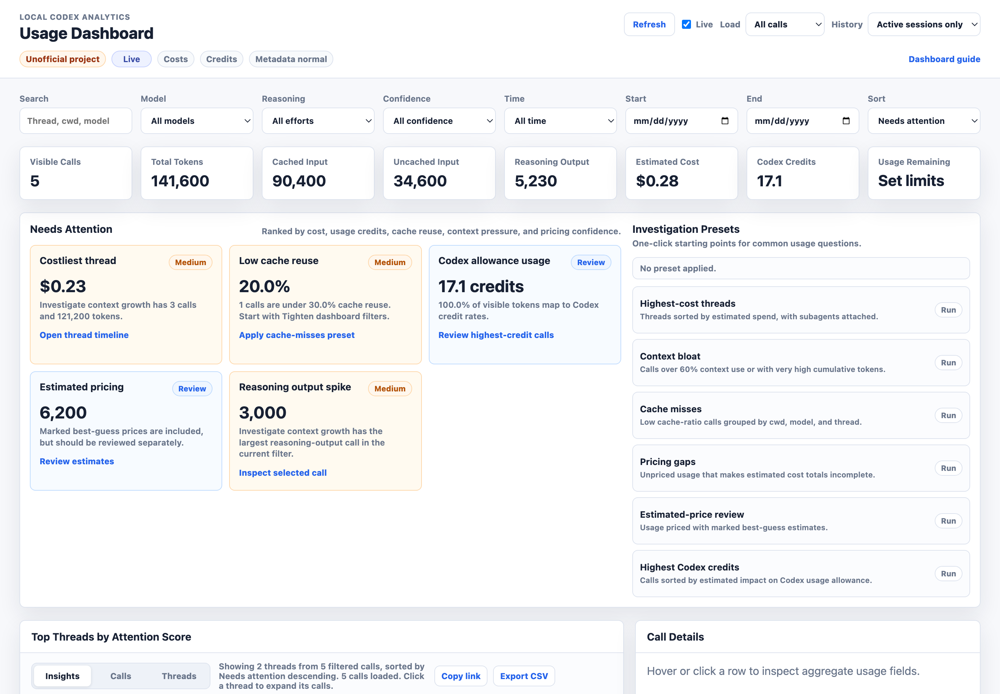
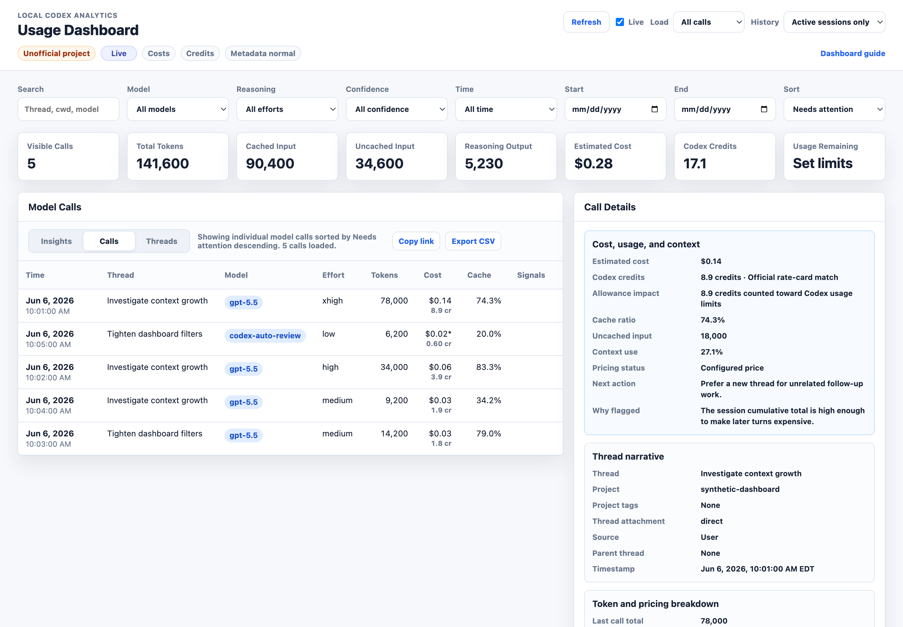
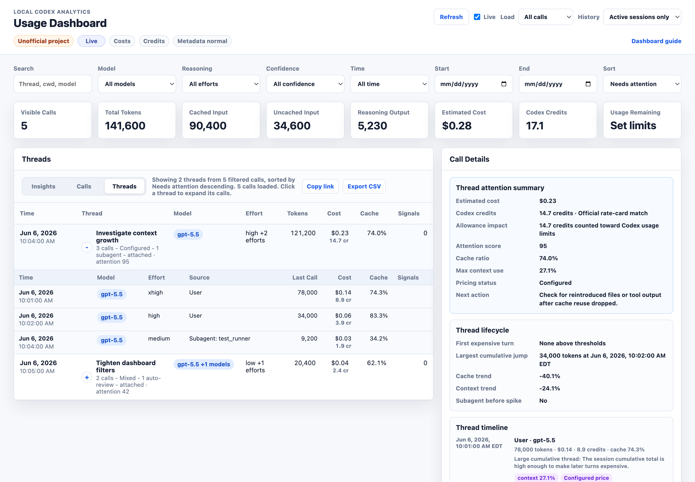
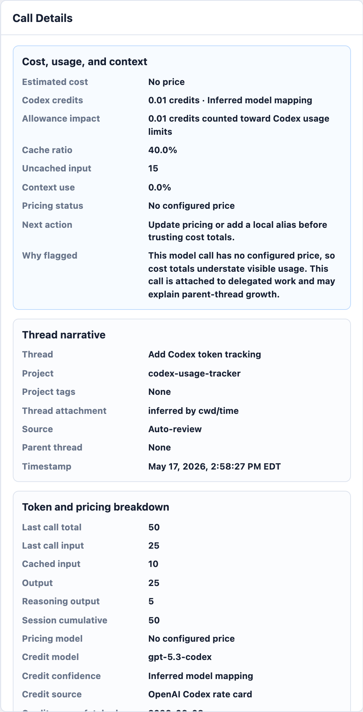

# Dashboard Guide

> **Unofficial project:** AI Usage Dashboard is independent and is not made by, affiliated with, endorsed by, sponsored by, or supported by OpenAI. OpenAI and Codex are trademarks of OpenAI.

This guide uses synthetic aggregate data. The screenshots do not contain prompts, assistant text, tool output, or real Codex or Claude Code session content.

> **Note:** The screenshots below still show the previous light theme. The dashboard now ships with the Terminal Sunset dark theme; layout and controls are unchanged, so the annotated walkthroughs remain accurate. Screenshots will be regenerated from synthetic fixtures.

## Open The Dashboard

For the best experience, run the localhost dashboard server:

```bash
ai-usage-dashboard setup
ai-usage-dashboard update-pricing
ai-usage-dashboard update-rate-card
ai-usage-dashboard refresh --source all
ai-usage-dashboard serve-dashboard --source all --open
```

Use `ai-usage-dashboard serve-dashboard --open` for the default all-sources dashboard. Use `--source codex`, `--source claude-code`, or `--source hermes` for a single-source dashboard; `--source all` indexes Codex, Claude Code, and Hermes when their local roots exist.

The Codex line of the `Usage Limits` card is populated from local Codex JSONL `rate_limits` snapshots when available. For optional manual allowance context, initialize a local template and copy values from Codex Usage or `/status`:

```bash
ai-usage-dashboard init-allowance
ai-usage-dashboard parse-allowance "5h 79% 6:50 PM Weekly 33% Jun 7"
```

The Claude line of the `Usage Limits` card is populated from a sanitized Claude Code status-line snapshot. Claude Code sends `rate_limits` to status-line commands after API responses for plans that expose those limits. To capture those values without storing transcript text, install the tracker wrapper once:

```bash
ai-usage-dashboard install-claude-limits-statusline
```

The installer updates `~/.claude/settings.json`. If you already have a custom Claude status line, it wraps and preserves that command and writes a backup before changing the file. The installed wrapper reads Claude Code's status-line JSON from stdin and writes only provider, window percentages, reset timestamps, and source metadata to `~/.codex-usage-tracker/claude-limits.json`.

To tune review thresholds locally, run `ai-usage-dashboard init-thresholds` and edit `~/.codex-usage-tracker/thresholds.json`. These thresholds control low-cache, high-context, high-uncached-input, large-thread, reasoning-spike, low-output, and high-cost recommendations.

To tune project attribution locally, run `ai-usage-dashboard init-projects` and edit `~/.codex-usage-tracker/projects.json`. The dashboard derives project name, relative cwd, branch, tags, and a hashed remote origin from aggregate `cwd` and local Git metadata when available.

Before sharing screenshots or generated artifacts, use `--privacy-mode redacted` or `--privacy-mode strict` before the subcommand:

```bash
ai-usage-dashboard --privacy-mode strict serve-dashboard --open
ai-usage-dashboard --privacy-mode strict dashboard --open
```

Redacted mode hides raw cwd/source paths, hides Git remote labels, and hashes unnamed projects while preserving configured aliases. Strict mode also hides project-relative cwd, Git branch, and tags. The dashboard header shows the active metadata mode.

The server keeps the HTML aggregate-only and enables two live features:

- `Refresh` rescans the source selected when the dashboard server started and updates the dashboard rows.
- `Load context` reads one selected model call from the original local JSONL file only when you ask for it.

For a static snapshot, use:

```bash
ai-usage-dashboard dashboard --open
```

Static file mode can still filter, sort, and inspect aggregate call fields. It cannot refresh from logs or load raw context until you open the dashboard through `serve-dashboard`.

The localhost server uses a random per-server token for refresh and context API calls, validates loopback `Host` and `Origin` headers, and can run as aggregate-only with `ai-usage-dashboard serve-dashboard --no-context-api`.

## Usage Analytics

Below the summary cards and Provider Details strip, the `Usage Analytics` section charts the visible rows:

- The usage-over-time chart stacks tokens (or estimated cost, via the `Tokens`/`Cost` toggle) per provider. `Today` uses hourly buckets; `This week` and `Last 7 days` use daily buckets; custom and longer ranges adapt from hourly to daily, weekly, and monthly.
- When a bounded time filter is active, each numeric summary card shows a delta against the preceding equal-length period (for example, `This week` compares against the same span of the prior week). Deltas are computed from loaded rows.
- `Reasoning Effort` breaks down calls, tokens, cost, and reasoning-output share per recorded effort level. Effort is captured going forward from status-line metadata, so older calls may be excluded; a coverage note shows how many visible calls carry an effort value.
- `Top Projects` ranks the visible projects by token volume with estimated cost and, when a prior period exists, a token-volume trend.
- `Limits Burn-down` plots remaining-capacity sparklines per provider window from the local limit-snapshot history (`~/.codex-usage-tracker/limit-history.json`) and forecasts time to exhaustion at the current pace. The Provider Details strip adds matching `pace` and `window drivers` rows — the projects consuming the active 5h/weekly window, computed from loaded rows.

The trend chart, effort, and project analytics are derived client-side from the same filtered aggregate rows the tables use. Burn-down uses the sanitized limit history, which stores only window percentages and timestamps.

## Insights View



The dashboard opens in `Insights` view. This view is designed to answer "what needs attention?" before you start sorting tables.

- `Needs Attention` cards rank costly threads, Codex allowance usage, low cache reuse, context bloat, unpriced usage, estimated pricing, and reasoning-output spikes from aggregate fields only.
- `Investigation Presets` apply a view, derived filter, sort order, and explanatory caption together.
- Presets include highest-cost threads, highest Codex credits, context bloat, cache misses, pricing gaps, and estimated-price review. Codex credit presets apply only to Codex/OpenAI rows; Claude Code and Hermes/DeepSeek rows are marked not applicable for Codex credits.
- `Overview`, `Codex`, `Claude Code`, and other detected provider tabs (rendered as bracketed segments like `[ overview ]`) keep mixed-source rollups separate from provider-specific detail. Use `Overview` for comparison, then switch into a provider tab when you want the cards and explanations to match that source's token semantics.
- The top table shows threads by attention score so you can jump from a summary signal into a thread timeline or selected call.
- Clear an active preset to return to normal manual filtering and sorting.

## Calls View



Use `Calls` view when you want to inspect individual model calls.

- The header stays compact: refresh controls on the right, and bracket-tag status chips (for example `[LIVE]`, `[STATIC]`) on the left. Exact refresh time, pricing source, and credit-rate source live in hover titles so live refreshes do not reflow the page. The decorative prompt line under the window dots echoes the active time filter and provider scope.
- The top cards are universal and provider-neutral: `Visible Calls`, `Total Tokens`, `Input Tokens`, `Cache Tokens`, `Output Tokens`, `Reasoning Tokens`, `Estimated Cost`, and `Usage Limits`. The labels never change with provider scope; provider tabs change which rows are in scope, not what the cards mean.
- `Usage Limits` shows remaining capacity. In `Overview` it shows one concise line per visible provider (for example `Codex 5h 72% · weekly 41%`); in a provider tab it shows only that provider's windows. Missing snapshots render as `No snapshots` or `<Provider> no snapshot`.
- A `Provider Details` strip below the top cards holds provider-specific metrics: Codex credits and credit-rate coverage, credit-rate source and fetched timestamp, allowance reset timestamps, the Claude status-line snapshot source and captured timestamp, and pricing caveats.
- Provider tabs are the primary source switch. `Overview` shows all visible providers together, while provider tabs such as `Codex`, `Claude Code`, or `DeepSeek` keep provider-specific explanations in scope.
- The `Provider` and `App` filters are still available for narrower source filtering, such as `openai / codex`, `anthropic / claude-code`, and `deepseek / hermes`.
- The `Confidence` filter separates exact cost, estimated cost, unpriced cost, exact credit-rate matches, inferred credit mappings, user credit overrides, missing credit rates, and rows where Codex credits are not applicable.
- The `Thread type` filter can show all rows, parent-thread rows only, or spawned/subagent rows only. Use `Parent threads only` when you want to study the main thread without its spawned work.
- The `Time` filter supports all time, today, this week, last 7 days, this month, and custom calendar ranges. It defaults to `This week`. Presets are relative to your browser's local date. Custom ranges use inclusive start and end dates.
- The `History` control defaults to `All history`. Switch to `Active sessions only` when you want to hide archived session rows from the current view and live refresh.
- The URL tracks the active view, filters, time preset or custom range, sort, preset, selected row or thread, page, and expanded threads. `Copy link` copies that state so the same investigation can be reopened.
- `Export CSV` downloads the currently filtered aggregate calls. In Threads view, it exports the calls behind the filtered thread list rather than only the visible group headers.
- A `Parser warnings` chip appears only when the latest refresh reports skipped token events, missing expected token fields, invalid counters, duplicate cumulative snapshots, or unknown event shapes. Use `ai-usage-dashboard inspect-log <path>` to inspect a suspect log without writing to SQLite.
- Search matches thread, cwd, model, source app/provider/format, session id, turn id, subagent role, and parent thread fields.
- Search also matches derived project names, project-relative cwd values, tags, branch names, and redacted remote labels.
- In redacted or strict privacy mode, search only sees the redacted metadata fields included in the dashboard payload.
- The cards summarize only the currently visible filtered rows. When served from localhost, the dashboard always loads every call in the selected time range; only static snapshots are capped, and they show a caveat when rows are missing.
- Time values are shown in your browser's local date/time format while sorting and time filtering still use the logged timestamp.
- Click a column header like `Time`, `Thread`, `Source`, `Tokens`, `Cost`, or `Cache` to sort. Use the sort menu for `Highest Codex credits`. Click the same header again to reverse the direction.
- Hover or click a row to pin its aggregate fields in `Call Details`; on desktop, the details panel stays visible as you scroll.
- The `Call Details` panel groups primary cost, Codex credit, allowance, cache, context, and pricing signals first, then thread narrative and token breakdowns.
- The first detail section includes a recommended action and a "why flagged" explanation derived only from aggregate counters and pricing/allowance metadata.
- Raw aggregate identifiers and source file metadata are collapsed until you need them.
- The details panel always reserves a visible scrollbar so long field lists are discoverable before you start scrolling.
- Pagination appears only when the active Insights, Calls, or Threads view has more than one page.
- When served from localhost, `/api/usage` accepts `limit`, `offset`, `since`, and `until` so automation can page aggregate rows or fetch an exact time window without loading an entire large history.
- After you scroll down, the bottom-right `Top` button returns to the top of the dashboard.

Useful interpretation notes:

- `Last call total` is the token usage for the selected model call.
- `Session cumulative` is the running total the source logged for that session at the time of that call.
- `Input Tokens` counts fresh input that was not served from cache; `Cache Tokens` combines cache reads with cache writes, and its hover title splits the two buckets. Call Details still shows the raw provider input buckets (`Cache read` and `Direct input` for Claude Code rows).
- Claude totals include direct input, cache writes, cache reads, and output, so very large totals are often mostly cache-read reuse rather than fresh prompt growth.
- A cost with `*` means the pricing row is marked as a best-guess estimate.
- Codex credits are estimated from aggregate input, cached-input, and output token counters for Codex/OpenAI rows only. Direct model matches use the bundled OpenAI Codex rate-card snapshot; inferred labels are marked estimated, local credit-rate overrides are marked user-provided, and Claude Code and Hermes/DeepSeek rows are marked not applicable.
- The Codex line of `Usage Limits` is read from local Codex `rate_limits` snapshots when available, without contacting a remote account API. Configure `~/.codex-usage-tracker/allowance.json` with values copied from Codex Settings > Usage, the Codex Usage dashboard, or `/status` when you want to override a dynamic window, add exact credit totals, or fill in missing local snapshot data.
- The Claude line of `Usage Limits` is read from `~/.codex-usage-tracker/claude-limits.json`, which can be filled automatically by `install-claude-limits-statusline`. It stores only percentages, reset timestamps, and source metadata.

## Threads View



Use `Threads` view when you want to understand a work session as a group instead of one call at a time.

- Each thread row groups the filtered model calls by thread name, falling back to session id when no name is available.
- Thread rows show latest activity, call count, source mix, model mix, effort mix, total tokens, estimated cost, Codex credits, cache ratio, and signal count.
- Mixed model summaries prefer the primary non-review model; `codex-auto-review` appears as the thread model only for review-only threads.
- Click a thread row to expand or collapse its calls. Multiple thread rows can stay open.
- Expanded calls are ordered oldest to newest by event timestamp, then cumulative token count.
- Subagents with logged parent session ids are shown under the parent thread. Auto-review sessions without explicit parent ids may be attached by cwd and nearby activity and are marked as attached or inferred in the details.

The same search, time range, confidence status, cards, and sort controls apply in `Insights`, `Calls`, and `Threads` views.

## Details And Context



The details panel is structured for progressive disclosure. On desktop, it sticks inside the viewport and scrolls internally when the selected call has more fields or loaded context than can fit on screen.

For selected calls, the panel shows:

- primary cost, Codex credits, allowance impact, cache, uncached input, context use, pricing status, source, and next action
- thread attachment, source app/provider/format, parent-thread, and timestamp narrative
- input, cache creation input, cached input, uncached input, output, reasoning output, cumulative tokens, pricing fields, credit model, credit confidence, and rate-card source metadata
- collapsed raw aggregate identifiers
- collapsed source JSONL file and line metadata

For selected threads, the panel shows:

- estimated cost, Codex credits, allowance impact, attention score, cache ratio, max context use, source mix, pricing status, and next action
- lifecycle signals: first expensive turn, largest cumulative jump, cache trend, context trend, and whether subagent or auto-review work appeared before a usage spike
- a compact thread timeline with recent calls, cost, credits, cache, context, and pricing cues
- direct, subagent, auto-review, attached-call, and spawned-thread relationship counts

When served from localhost, the details panel includes `Load context` and `Include tool output`.

- `Load context` fetches a size-limited, redacted context excerpt for only that call.
- `Include tool output` repeats the request with tool output included, still redacted and capped.
- Raw context is not written to SQLite, CSV, or the generated dashboard HTML.
- If the server was started with `--no-context-api`, the context buttons stay disabled and the dashboard remains aggregate-only.

## Practical Workflow

1. Start with `serve-dashboard --source all --open` when tracking all supported local sources, or `serve-dashboard --source codex --open` for Codex only.
2. Use `Refresh` after a Codex, Claude Code, or Hermes run finishes, or leave `Live` enabled while you work.
3. Leave `History` on `All history` when you want time filters to include every indexed session. Switch to `Active sessions only` when you want to hide archived sessions during live refresh.
4. Optionally run `parse-allowance` with copied values from Codex Usage or `/status`, or initialize and edit `allowance.json` manually, when you want to override or supplement the dynamic Codex snapshot.
5. Start in `Overview` and `Insights` to compare providers, then switch to the relevant provider tab before interpreting provider-specific cards.
6. Use `Thread type` to focus on parent threads or spawned/subagent work.
7. Narrow the `Time` filter when you are investigating a recent spike or a specific work window.
8. Use a preset when the question is already clear: highest-cost threads, highest Codex credits, context bloat, cache misses, pricing gaps, or estimated-price review.
9. Use `Threads` view to find the active work thread and any spawned subagent calls.
10. Sort by `Cost`, `Highest Codex credits`, `Tokens`, `Cache`, or `Context` when you need manual comparison.
11. Use `Copy link` when you want to return to the same filter/sort/selection state later.
12. Use `Export CSV` when the current filtered aggregate calls need spreadsheet review.
13. Click into a row and use `Load context` only when aggregate fields are not enough to explain the call.

## Investigating Long Chat Growth

Long-running coding-agent chats can carry a surprising amount of context into later turns. Prompt caching can reduce the cost of repeated input, but it does not make a large conversation free. Later calls may still include a large cached prefix, new uncached input, reasoning output, and tool-related context.

Use these dashboard fields together:

- `Cached input`: repeated context the source was able to reuse.
- `Uncached input`: fresh context added by the current turn.
- `Session cumulative`: the running total the source logged for the session.
- `Context use`: how much of the model's context window the call used.
- `Cache ratio`: whether the call is mostly reused context or mostly new input.

When a thread keeps growing but the old context is no longer helping, starting a fresh agent thread may be more efficient than continuing to carry the same cached history forward.

## Privacy Model

The dashboard is designed to be shareable as an aggregate report, but only after you review it like any generated artifact.

It includes:

- session ids, thread names, cwd values, source file paths, source provider/app/format labels, timestamps, model labels, reasoning effort, token counts, cost estimates, Codex credit estimates where applicable, dynamic or manually entered allowance windows, and derived ratios

It does not include:

- prompts, assistant responses, raw tool output, pasted secrets, message snippets, or transcript text

The screenshots in this guide are produced from synthetic fixture data used by the test suite.

Use `--privacy-mode redacted` or `--privacy-mode strict` before sharing generated dashboards, CSV exports, query JSON, or support bundles. Redacted mode removes raw cwd/source paths and hides unnamed project names behind stable hashes. Strict mode also hides project-relative cwd, branch, and tags. Configured project aliases are treated as explicit display opt-ins in both modes.

Remaining 5-hour and weekly Codex allowance is read from local Codex `rate_limits` metadata when those snapshots are present. It is not inferred from the logged-in account plan, and no remote usage or account API is called. Add `~/.codex-usage-tracker/allowance.json` when you want to override dynamic values, add exact credit totals, or provide copied allowance state for environments without dynamic snapshots. Local Codex logs may also omit usage from other ChatGPT agentic surfaces that share the same allowance.

Claude Code remaining limits are read from a local sanitized status-line snapshot at `~/.codex-usage-tracker/claude-limits.json`. Run `ai-usage-dashboard install-claude-limits-statusline` once to update `~/.claude/settings.json`; the installer preserves an existing status-line command by wrapping it.

Dashboard payloads include archived sessions by default so time filters cover all indexed usage. Use `Active sessions only` or `--active-only` when you want current-work views that hide archived rows.

Pricing and Codex credit estimates are source-stamped local calculations. Use `ai-usage-dashboard pin-pricing --output <path>` when a report needs to keep the same USD pricing snapshot over time, and use `ai-usage-dashboard update-rate-card` when you want an explicit local copy of the bundled Codex credit rate-card snapshot. `update-pricing` refreshes OpenAI pricing by default; add `--include-deepseek` for DeepSeek API pricing, and add manual local prices for other models when you want USD estimates for those rows.
